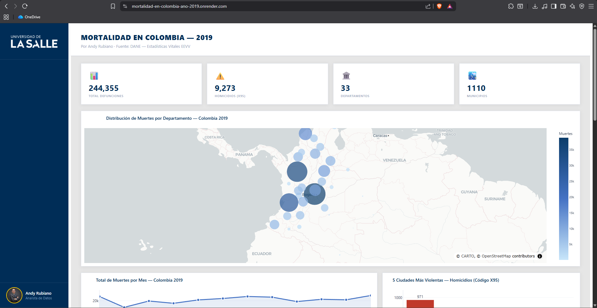
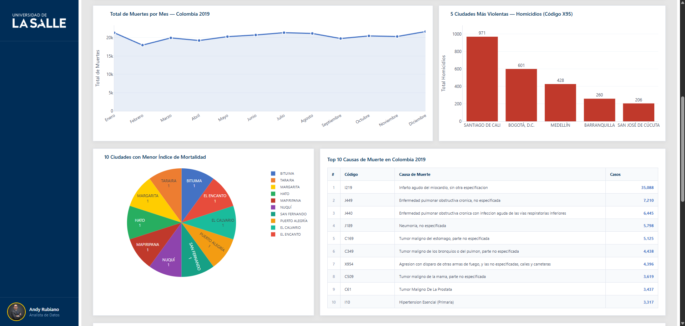
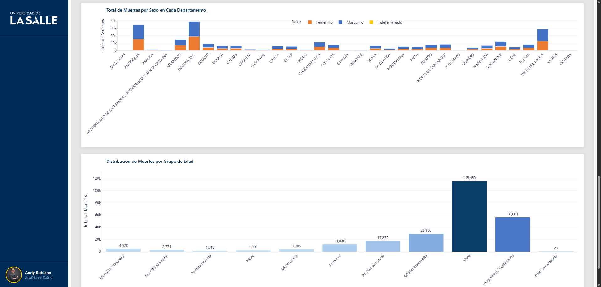

<div align="center">
  
</div>

# 📊 Colombia Mortality Dashboard

<div align="center">
  
  
  ### 👨‍🎓 Andrés Giovanny Rubiano Muñoz
  #### *Andy Rubiano*
  
  📚 **Programa:** Maestría en Inteligencia Artificial  
  🏫 **Universidad:** Universidad de La Salle  
  📧 **Correo:** arubiano67@unisalle.edu.co  
</div>

---

## 📋 Introducción del Proyecto

El **Colombia Mortality Dashboard** es una aplicación web interactiva desarrollada con Dash y Plotly que permite visualizar y analizar datos de mortalidad en Colombia durante el año 2019. Esta herramienta proporciona insights valiosos sobre patrones de mortalidad, causas de muerte y distribución geográfica en el territorio colombiano.

---

## 🎯 Objetivo

Este proyecto busca:

- **Analizar patrones de mortalidad** en Colombia por departamento, municipio, sexo y grupo de edad
- **Identificar causas principales** de muerte y su distribución geográfica
- **Detectar zonas críticas** con mayores tasas de mortalidad
- **Visualizar tendencias temporales** de mortalidad a lo largo de 2019
- **Facilitar el análisis exploratorio** de datos de mortalidad mediante una interfaz intuitiva
- **Apoyar la toma de decisiones** en políticas de salud pública

---

## 📁 Estructura del Proyecto

```
Colombia-Mortality-Dashboard/
├── app.py                          # Punto de entrada de la aplicación
├── requirements.txt                # Dependencias del proyecto
├── .gitignore                      # Reglas de exclusión de Git
├── README.md                       # Este archivo
│
├── src/                            # Módulos de la aplicación
│   ├── data.py                     # Carga, limpieza y exposición de datos
│   ├── layout.py                   # Estructura HTML/componentes del dashboard
│   ├── callbacks.py                # Lógica reactiva e interactividad
│   ├── dashboard.py                # Instancia principal de Dash
│   └── theme.py                    # Paleta de colores y estilos globales
│
├── public/                         # Recursos estáticos y visuales
│   ├── UnisalleLogo.png            # Logo oficial Universidad de La Salle
│   ├── UnisalleDarkLogoV1.png      # Variante oscura del logo (v1)
│   ├── UnisalleDarkLogoV2.png      # Variante oscura del logo (v2)
│   └── assets/
│       └── images/
│           ├── author/
│           │   └── Andy Rubiano.png # Foto del autor
│           └── screenshots/        # Capturas de pantalla del dashboard
│               ├── Dashboard_1.png # Panel principal: KPIs y mapa coroplético
│               ├── Dashboard_2.png # Tendencia mensual, homicidios y causas
│               └── Dashboard_3.png # Mortalidad por sexo y grupo de edad
│
└── utils/                          # Utilidades y datos
    ├── raw/                        # Datos fuente originales (sin procesar)
    │   ├── Anexo1.NoFetal2019_CE_15-03-23.xlsx  # Archivo original de mortalidad no fetal
    │   ├── Anexo2.CodigosDeMuerte_CE_15-03-23.xlsx # Códigos de causas de muerte (fuente)
    │   ├── Divipola_CE_.xlsx       # División política administrativa (fuente)
    │   └── ddi-documentation-spanish-696.pdf    # Documentación técnica del dataset
    │
    └── data/                       # Datasets procesados listos para la app
        ├── nofetal2019.csv         # Registros de mortalidad no fetal (2019)
        ├── divipola.csv            # División política administrativa (DANE)
        ├── codigos_muerte.csv      # Catálogo de causas de muerte (CIE-10)
        └── Colombia.geo.json       # Geometría GeoJSON de los 33 departamentos
```

### Descripción de Archivos Principales:

- **app.py**: Punto de entrada minimalista; importa la instancia Dash desde `src/dashboard.py` y arranca el servidor en el puerto 8050.

- **src/data.py**: Carga y preprocesa todos los datasets (`nofetal2019.csv`, `divipola.csv`, `codigos_muerte.csv`, `Colombia.geo.json`), genera los mapeos de códigos a nombres y exporta las variables compartidas por los demás módulos.

- **src/layout.py**: Define la estructura visual del dashboard (encabezado, KPIs, tarjetas de gráficos y tabla) usando componentes Dash y DCC.

- **src/callbacks.py**: Registra los callbacks reactivos que filtran datos y actualizan todas las visualizaciones en respuesta a los controles del usuario.

- **src/theme.py**: Centraliza la paleta de colores, estilos de tarjetas y configuraciones de layout reutilizables en los gráficos.

- **utils/data/Colombia.geo.json**: Geometría GeoJSON con las fronteras exactas de los 33 departamentos de Colombia, utilizada para renderizar el mapa coroplético.

- **utils/raw/**: Archivos fuente originales descargados del DANE, en formato Excel y PDF, antes de cualquier transformación o limpieza.

- **public/assets/images/screenshots/**: Capturas del dashboard en funcionamiento, usadas en la documentación del proyecto.

---

## 📦 Requisitos

### Dependencias:

| Librería | Versión | Descripción |
|----------|---------|-------------|
| Dash | 4.1.0 | Framework web para dashboards interactivos |
| Plotly | 6.7.0 | Biblioteca de visualización |
| Pandas | 3.0.2 | Análisis y manipulación de datos |
| Gunicorn | 26.0.0 | Servidor WSGI para producción |

### Requisitos del Sistema:

- Python 3.8 o superior
- pip (gestor de paquetes de Python)
- Navegador web moderno (Chrome, Firefox, Edge, Safari)

---

## 🚀 Instalación

### 1. Clonar el repositorio

```bash
git clone https://github.com/tu-usuario/Colombia-Mortality-Dashboard.git
cd Colombia-Mortality-Dashboard
```

### 2. Crear un entorno virtual (recomendado)

**En Windows:**
```bash
python -m venv venv
venv\Scripts\activate
```

**En macOS/Linux:**
```bash
python3 -m venv venv
source venv/bin/activate
```

### 3. Instalar dependencias

```bash
pip install -r requirements.txt
```

### 4. Ejecutar la aplicación localmente

```bash
python app.py
```

La aplicación estará disponible en: `http://localhost:8050`

---

## 💻 Software Utilizado

| Tecnología | Versión | Propósito |
|-----------|---------|----------|
| **Python** | 3.8+ | Lenguaje de programación principal |
| **Dash** | 4.1.0 | Framework para crear dashboards interactivos |
| **Plotly** | 6.7.0 | Visualizaciones interactivas |
| **Pandas** | 3.0.2 | Manipulación y análisis de datos |
| **Gunicorn** | 26.0.0 | Servidor web para producción |
| **Git** | Latest | Control de versiones |

---

## 🌐 Despliegue en Render

Este proyecto está configurado para desplegarse fácilmente en **Render**, una plataforma de hosting moderna.

### Pasos para desplegar:

#### 1. Preparación en el repositorio
Asegúrate de tener:
- `requirements.txt` actualizado ✓
- `app.py` en la raíz del proyecto ✓
- `.gitignore` configurado ✓

#### 2. Crear cuenta en Render
- Ve a [render.com](https://render.com)
- Crea una cuenta gratuita
- Conecta tu repositorio de GitHub

#### 3. Crear un nuevo servicio Web

1. Click en **"New +"** → **"Web Service"**
2. Selecciona tu repositorio
3. Configura los siguientes parámetros:

   - **Name**: `mortalidad-en-colombia-ano-2019`
   - **Environment**: `Python`
   - **Build Command**: `pip install -r requirements.txt`
   - **Start Command**: `gunicorn app:server`
   - **Plan**: Selecciona según necesidades (Free/Paid)

#### 4. Variables de entorno (si aplica)

En caso de necesitar variables de entorno, añádelas en:
Settings → Environment → Add Environment Variable

#### 5. Deploy automático

- El deploy se inicia automáticamente cuando subes cambios a GitHub
- Puedes visualizar logs en tiempo real desde el dashboard de Render
- Tu aplicación estará disponible en: https://mortalidad-en-colombia-ano-2019.onrender.com/

#### 6. Monitoreo

- Render proporciona métricas de uso
- Monitorea logs para detectar errores
- El servicio se puede pausar/reanudar desde el dashboard

---

## 📊 Visualizaciones

### Vista 1 — Panel Principal: KPIs y Mapa Geográfico



Esta primera vista muestra el encabezado del dashboard con cuatro **indicadores clave (KPIs)** que resumen el panorama general de mortalidad en Colombia durante 2019:

- **244,355** — Total de defunciones registradas en el año
- **9,273** — Municipios con al menos un registro de mortalidad
- **33** — Departamentos del país representados en los datos
- **1,110** — Causas de muerte únicas identificadas según CIE-10

Debajo de los KPIs se presenta el **mapa coroplético** titulado *"Distribución de Muertes por Departamento — Colombia 2019"*. Cada departamento se representa como un polígono con fronteras geográficas exactas, coloreado según la escala azul claro → azul oscuro en función del total de defunciones registradas. Los departamentos con mayor carga de mortalidad, como Bogotá D.C., Antioquia y Valle del Cauca, aparecen en tonos más oscuros, revelando de forma intuitiva la concentración de muertes en zonas de alta densidad poblacional.

---

### Vista 2 — Tendencia Mensual, Homicidios, Ciudades con Menor Mortalidad y Top 10 Causas



Esta vista agrupa cuatro visualizaciones complementarias:

**Total de Muertes por Mes — Colombia 2019 (gráfico de área)**  
Muestra la evolución mensual del total de defunciones a lo largo del año. La línea se mantiene relativamente estable entre los 19,000 y 22,000 casos mensuales, con un leve descenso en febrero y una tendencia de recuperación hacia diciembre. Esto sugiere una mortalidad sostenida sin picos epidémicos extremos durante 2019.

**5 Ciudades Más Violentas — Homicidios (Código X95)**  
Gráfico de barras verticales que posiciona a Santiago de Cali en el primer lugar con **971 homicidios**, seguida de Bogotá D.C. (601), Medellín (428), Barranquilla (260) y San José de Cúcuta (206). La diferencia entre Cali y las demás ciudades es marcada, indicando una problemática de violencia armada significativamente mayor en esa ciudad.

**10 Ciudades con Menor Índice de Mortalidad (gráfico de torta)**  
Identifica los municipios con solo **1 defunción registrada** durante el año: Bituima, El Encanto, El Calvario, Puerto Alegría, San Fernando, Nuquí, Mapiripana, Hato, Margarita y Taraira. Todos con igual proporción en el gráfico, reflejan municipios de baja densidad poblacional o con subregistro en zonas rurales y fronterizas.

**Top 10 Causas de Muerte en Colombia 2019 (tabla interactiva)**  
Tabla ordenada por número de casos que clasifica las causas según códigos CIE-10:

| # | Código | Causa | Casos |
|---|--------|-------|-------|
| 1 | I219 | Infarto agudo del miocardio, sin otra especificación | 35,088 |
| 2 | J449 | Enfermedad pulmonar obstructiva crónica, no especificada | 7,210 |
| 3 | J440 | EPOC con infección aguda de vías respiratorias inferiores | 6,445 |
| 4 | J189 | Neumonía, no especificada | 5,798 |
| 5 | C169 | Tumor maligno del estómago, parte no especificada | 5,125 |
| 6 | C349 | Tumor maligno de bronquios o pulmón | 4,438 |
| 7 | X954 | Agresión con disparo de armas de fuego en calles/carreteras | 4,396 |
| 8 | C509 | Tumor maligno de la mama, parte no especificada | 3,619 |
| 9 | C61 | Tumor maligno de la próstata | 3,437 |
| 10 | I10 | Hipertensión esencial (primaria) | 3,317 |

Las enfermedades cardiovasculares y respiratorias dominan el registro, con el infarto de miocardio como causa líder absoluta.

---

### Vista 3 — Mortalidad por Sexo y por Grupo de Edad



Esta vista final desagrega la mortalidad en dos dimensiones demográficas clave:

**Total de Muertes por Sexo en Cada Departamento (barras apiladas)**  
Gráfico de barras apiladas que muestra para cada uno de los 33 departamentos la proporción de muertes según sexo: **masculino (azul)**, **femenino (naranja)** e **indeterminado (amarillo)**. Antioquia y Bogotá D.C. lideran en volumen absoluto, superando los 30,000 casos combinados. En la mayoría de departamentos la mortalidad masculina supera a la femenina, patrón consistente con causas externas (violencia, accidentes) que afectan más a hombres. Departamentos como Vaupés y Vichada presentan valores muy bajos con escasa diferenciación por sexo.

**Distribución de Muertes por Grupo de Edad (barras verticales)**  
Visualiza el total de defunciones agrupado en las categorías epidemiológicas definidas por el proyecto:

| Grupo de Edad | Total |
|---------------|-------|
| Mortalidad neonatal (0-28 días) | 4,520 |
| Mortalidad infantil (29 días - 1 año) | 2,771 |
| Primera infancia (1-2 años) | 1,518 |
| Niñez (3-5 años) | 1,993 |
| Adolescencia (6-11 años) | 3,795 |
| Juventud (12-18 años) | 11,840 |
| Adultez temprana (19-26 años) | 17,276 |
| Adultez intermedia (27-59 años) | 29,105 |
| Vejez (60-74 años) | **115,453** |
| Longevidad / Centenarios (75+ años) | 56,061 |
| Edad desconocida | 23 |

El grupo de **vejez concentra casi la mitad de todas las defunciones** del año, lo que evidencia la carga de enfermedades crónicas en adultos mayores. La mortalidad neonatal (4,520 casos) es el indicador más crítico en los primeros años de vida y representa un área prioritaria de intervención en salud pública.

---

## 📈 Análisis por Categorías de Edad

El proyecto categoriza la población en grupos de edad con significado epidemiológico:

- **Mortalidad neonatal**: 0-28 días
- **Mortalidad infantil**: 29 días - 1 año
- **Primera infancia**: 1-2 años
- **Niñez**: 3-5 años
- **Adolescencia**: 6-11 años
- **Juventud**: 12-18 años
- **Adultez temprana**: 19-26 años
- **Adultez intermedia**: 27-59 años
- **Vejez**: 60-74 años
- **Longevidad/Centenarios**: 75+ años

---

## 🔍 Fuentes de Datos

- **nofetal2019.csv**: Registros de mortalidad no fetal en Colombia (año 2019)
- **divipola.csv**: Base de datos de división política administrativa
- **codigos_muerte.csv**: Clasificación Internacional de Enfermedades (CIE-10)

---

## 📝 Notas Importantes

- Los datos corresponden exclusivamente al año 2019
- La clasificación de causas sigue estándares CIE-10 internacionales
- Los municipios se identifican mediante códigos DANE
- Las categorías de edad utilizan criterios epidemiológicos estándar
- La aplicación requiere conexión a internet para algunas funciones de Plotly

---

## 🛠️ Desarrollo Futuro

Posibles mejoras y expansiones:

- [ ] Agregar datos de años adicionales para análisis longitudinal
- [ ] Implementar predicciones con Machine Learning
- [ ] Añadir filtros avanzados y búsqueda
- [ ] Generar reportes exportables en PDF
- [ ] Análisis por causas prevenibles
- [ ] Integración con APIs de datos en tiempo real
- [ ] Dashboard mobile responsivo mejorado
- [ ] Análisis de correlaciones con variables socioeconómicas

---

## 📧 Contacto

<div align="center">
  

  **👨‍💼 Andrés Giovanny Rubiano Muñoz**  
  *Maestría en Inteligencia Artificial*

  📧 **Correo:** arubiano67@unisalle.edu.co  
  🏫 **Universidad:** Universidad de La Salle
</div>

---

## 📄 Licencia

Este proyecto está disponible bajo licencia a educativa. Para más información, contacta al autor.

---

<div align="center">
  **2026 © Todos los derechos reservados | Universidad de La Salle**
</div>
